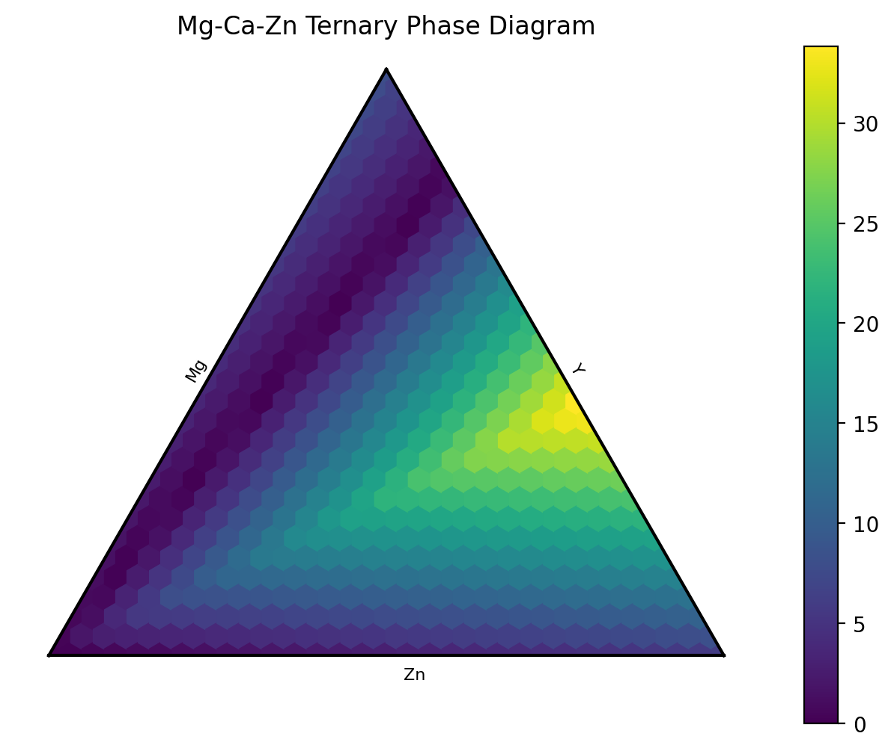

# Python Ternary Property Map Generator

This Python code generates a ternary property map using the `numpy`, `pandas`, and `ternary` libraries. The ternary property map represents the distribution of a specific property or parameter in a system composed of three components.

## Prerequisites
- Python 3.x
- numpy
- pandas
- ternary

## Usage
1. Install the required libraries using pip:
```
pip install numpy pandas ternary
```
2. Save the code in a Python file (e.g., `ternary_property_map.py`).
3. Import the required libraries:
```python
import numpy as np
import pandas as pd
import ternary
```
4. Execute the code to generate the ternary property map:
```python
# Generate ternary data
tr = generate_ternary_data()

# Generate ternary property map
tr = generate_ternary_phases(tr)

# Plot ternary property map
plot_ternary_property_map(tr)
```

## Functions

### `generate_ternary_data()`
This function generates ternary data by creating a Pandas DataFrame representing the composition of each point in the ternary system. The data is then saved to an Excel file named "Ternary-... .xlsx". The generated DataFrame is returned.

### `plot_ternary_property_map(tr)`
This function generates a ternary property map using the ternary library. It extracts the relevant data from the DataFrame `tr` and plots a heatmap of the ternary system. The function sets labels and titles for the axes and displays the plot.

## Example Output
The code generates a ternary property map for the Mg-Ca-Zn system, based on the provided data.



## Notes
- Ensure that the required Excel files (`Ternary-... .xlsx` and `Ternary-... .xlsx`) exist in the same directory as the script, or modify the file paths accordingly in the code.
- The code assumes that the necessary data files are available and properly formatted. Make sure to provide the correct data or modify the code to match your data structure.
- Additional customization options are available in the ternary library for further customization of the property map plot.
